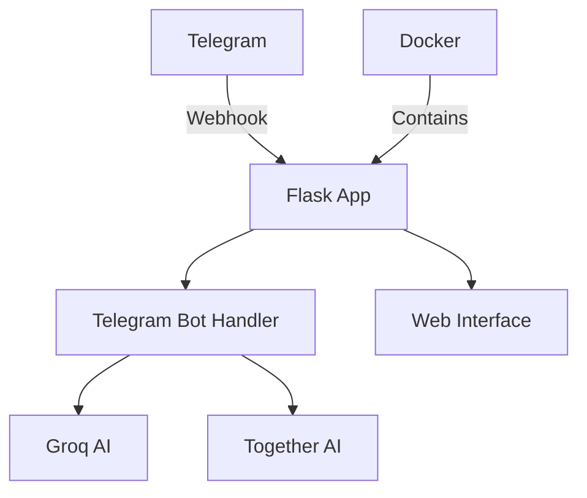

# AIFusionBot Documentation
{: .fs-9 }

A comprehensive Flask-based Telegram bot that combines advanced AI chat capabilities with image generation.
{: .fs-6 .fw-300 }

[Get Started](setup.md){: .btn .btn-primary .fs-5 .mb-4 .mb-md-0 .mr-2 }
[View on GitHub](https://github.com/Amul-Thantharate/AIFusionBot){: .btn .fs-5 .mb-4 .mb-md-0 }

---

## Overview

AIFusionBot is a cutting-edge Telegram bot that combines the power of Groq's advanced language models and Together AI's image generation capabilities. Built with Flask and Docker, it offers seamless chat interactions, stunning image creation, and upcoming video generation features. Perfect for both casual users and developers, it provides an intuitive interface for AI-powered conversations, creative image generation, and robust chat management—all within your Telegram app. Whether you're looking to have engaging conversations, create unique images, or build upon the platform, AIFusionBot offers a complete AI assistant experience.

### Key Features

- **Advanced AI Chat**: Powered by Groq's Llama3-8b-8192 model
- **Dual Image Generation**: Basic and high-quality options
- **Flask Web Interface**: Professional grade web server
- **Webhook Support**: Real-time Telegram updates
- **Chat Management**: Export and clear chat history
- **Customizable Settings**: Adjust AI parameters

### Architecture

### Tech Stack

- **Backend Framework**: Flask
- **WSGI Server**: Gunicorn
- **Container**: Docker
- **AI Services**: 
  - Groq (Chat)
  - Together AI (Image Generation)
- **Database**: SQLite (Coming Soon)

## Quick Access

You can start using AIFusionBot immediately by accessing our Telegram bot:

👉 [Access AIFusionBot on Telegram](https://t.me/A_iFusion_bot)

Simply click the link above or search for `@A_iFusion_bot` on Telegram to begin chatting with our AI assistant.

### Getting Started

1. Click the bot link: [https://t.me/A_iFusion_bot](https://t.me/A_iFusion_bot)
2. Start the bot by clicking the "Start" button or sending `/start`
3. Begin chatting or generating images right away!

## API Keys Setup

To run your own instance of AIFusionBot, you'll need the following API keys:

### Groq API Key
1. Visit [Groq's website](https://console.groq.com)
2. Sign up for an account
3. Navigate to API Keys section
4. Generate a new API key
5. Copy and save your API key securely

### Together AI API Key
1. Go to [Together AI Platform](https://api.together.xyz)
2. Create an account
3. Navigate to Settings → API Keys
4. Generate a new API key
5. Store your API key safely

⚠️ **Important Security Notes:**
- Never share your API keys publicly
- Store API keys in environment variables or `.env` file
- Don't commit API keys to version control
- Rotate keys periodically for better security

## Getting Started

1. [Setup Instructions](setup.md)
2. [Command Reference](commands.md)
3. [Changelog](changelog.md)

## Future Releases

Stay tuned for exciting new features coming to AIFusionBot! Here's our development roadmap:

### Version 1.1 (Q2 2024)
{: .text-purple-200 }
- 🔄 Real-time chat synchronization
- 🎨 Additional image generation models
- 🎨 Text to Vedio (Replicate) 
### Version 1.2 (Q3 2024)
{: .text-blue-200 }
- 👥 Multi-user support
- 🔐 Enhanced security features
- 📊 Usage analytics dashboard
- 🌐 Multi-language support

### Version 1.3 (Q4 2024)
{: .text-green-200 }
- 🎵 Audio message processing
- 📹 Video generation capabilities
- 🔗 API integration for third-party apps

*Note: Release timeline is tentative and may be adjusted based on development progress and user feedback.*

## Contributing

We welcome contributions! Please see our [Contributing Guide](https://github.com/Amul-Thantharate/AIFusionBot/blob/main/CONTRIBUTING.md) for details.

## Support

Need help? Check our [setup guide](setup.md) or [open an issue](https://github.com/Amul-Thantharate/AIFusionBot/issues).
