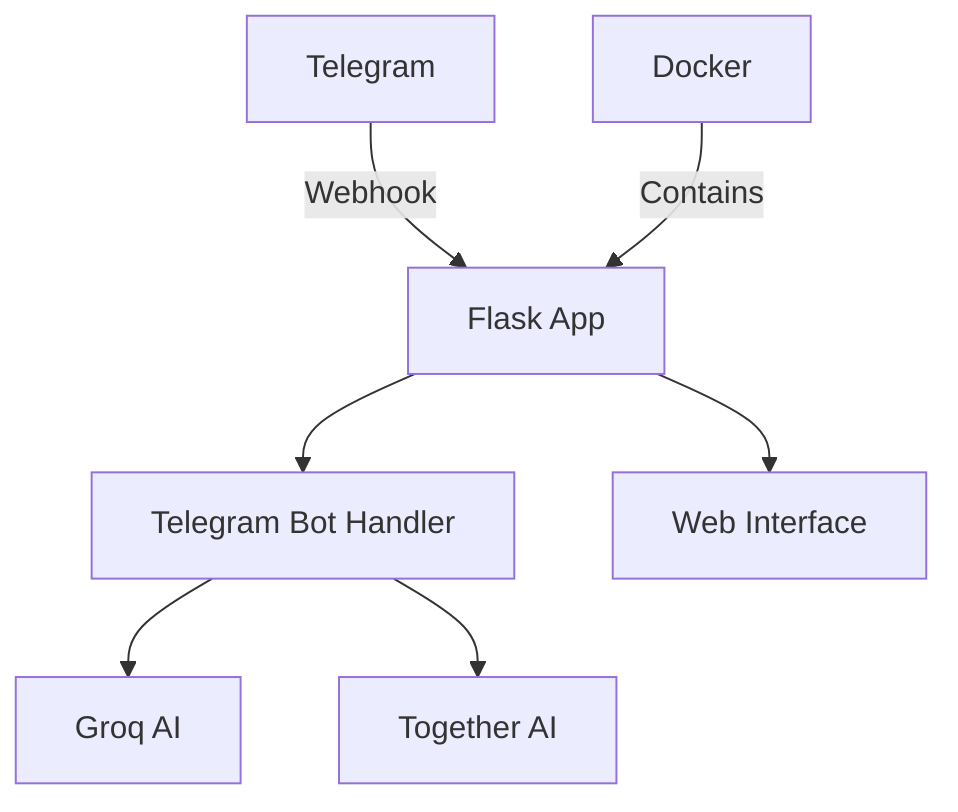

# NovaChat AI Documentation
{: .fs-9 }

A comprehensive Flask-based Telegram bot that combines advanced AI chat capabilities with image generation.
{: .fs-6 .fw-300 }

[Get Started](setup.md){: .btn .btn-primary .fs-5 .mb-4 .mb-md-0 .mr-2 }
[View on GitHub](https://github.com/yourusername/NovaChat-AI){: .btn .fs-5 .mb-4 .mb-md-0 }

---

## Overview

NovaChat AI is a powerful Telegram bot built with Flask that integrates multiple AI services to provide a comprehensive chat and image generation experience. It leverages Groq's language models for intelligent conversations and Together AI for high-quality image generation.

### Key Features

- 🤖 **Advanced AI Chat**: Powered by Groq's Llama3-8b-8192 model
- 🎨 **Dual Image Generation**: Basic and high-quality options
- 🌐 **Flask Web Interface**: Professional grade web server
- 🔄 **Webhook Support**: Real-time Telegram updates
- 💾 **Chat Management**: Export and clear chat history
- 🔧 **Customizable Settings**: Adjust AI parameters

### Architecture

### Tech Stack

- **Backend Framework**: Flask
- **WSGI Server**: Gunicorn
- **Container**: Docker
- **AI Services**: 
  - Groq (Chat)
  - Together AI (Image Generation)
- **Database**: SQLite (Coming Soon)

## Getting Started

1. [Setup Instructions](setup.md)
2. [Command Reference](commands.md)
3. [Changelog](changelog.md)

## Contributing

We welcome contributions! Please see our [Contributing Guide](https://github.com/yourusername/NovaChat-AI/blob/main/CONTRIBUTING.md) for details.

## Support

Need help? Check our [setup guide](setup.md) or [open an issue](https://github.com/yourusername/NovaChat-AI/issues).
